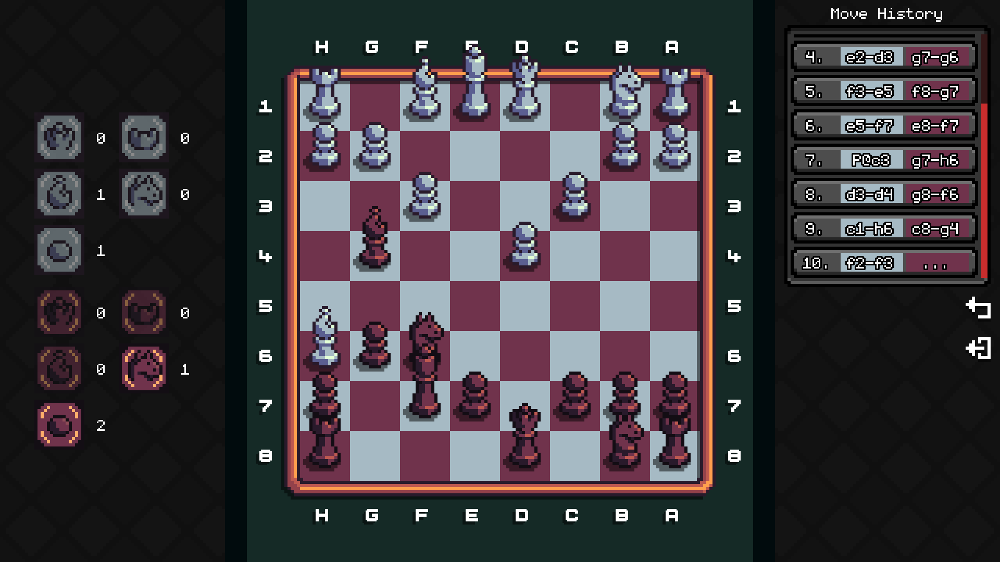
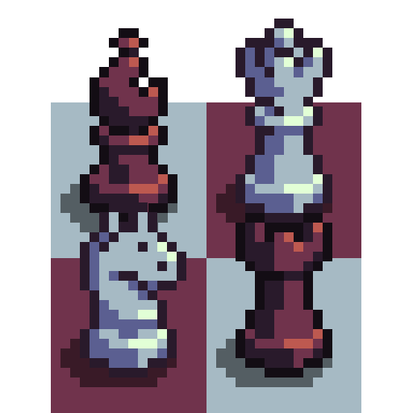

  

 

# Chessmaty ♟️

Chessmaty is a pixel art chess game, created with Godot Engine and Rust's Shakmaty crate.

 

## Architecture

Rust and shakmaty power the core chess logic, move generation, and rule evaluation, while Godot handles the user interface, input processing and board rendering.

Asynchronous processing and background tasks are managed by Godot threads rather than an async Rust runtime.

The Rust crate is compiled into a dynamic C library (.dll and .so) and Godot uses this library as a GDExtension via the C ABI.

 

## Supported Play Modes
- **Local Multiplayer:** Same-device Human vs. Human play.
- **Local AI:** Single-player mode against Fairy-Stockfish (supporting chess variants).
- **LAN Multiplayer:** Play over a Local Area Network.

 

## Game Variants

Chessmaty supports 9 different chess variants (inspired by [Lichess](https://lichess.org/)):

- **Standard:** Classic chess rules and setup.
- **Chess960 (Fischer Random):** Starting piece positions are randomized.
- **King of the Hill:** Bring your King to the center of the board to win.
- **Three-Check:** Check your opponent's King three times to win.
- **Crazyhouse:** Captured pieces join your pocket and can be dropped back onto the board.
- **Antichess (Giveaway):** Lose all your pieces or get stalemated to win.
- **Atomic:** Captures cause explosions that destroy surrounding non-pawn pieces.
- **Horde:** One side plays with a massive army of Pawns against standard pieces.
- **Racing Kings:** Race your King to the 8th rank before your opponent does.

 

## Used Tools

<table align="center">
  <tr>
    <td align="center" width="160">
      <a href="https://godotengine.org/" target="_blank">
          
        <b>Godot Engine</b>
      </a>
    </td>
    <td align="center" width="160">
      <a href="https://godot-rust.github.io/" target="_blank">
          
        <b>godot-rust</b>
      </a>
    </td>
    <td align="center" width="160">
      <a href="https://crates.io/crates/shakmaty" target="_blank">
          
        <b>Shakmaty</b>
      </a>
    </td>
    <td align="center" width="160">
      <a href="https://fairy-stockfish.github.io/" target="_blank">
          
        <b>Fairy-Stockfish</b>
      </a>
    </td>
  </tr>
</table>

 

## Credits & Assets
- **Pixel Chess Sprites:** [Pixel Chess on itch.io](https://nulltale.itch.io/chess) - Asset by nulltale ([nulltale.itch.io](https://nulltale.itch.io/))
- **Monogram font:** [monogram by datagoblin](https://datagoblin.itch.io/monogram) - Font by datagoblin ([datagoblin.itch.io](https://datagoblin.itch.io/))
- **Bold Pixels Font:** [Bold Pixels on itch.io](https://yukipixels.itch.io/boldpixels) - Font by Yūki ([@YukiPixels](https://linktr.ee/yukipixels))
- **Sound effects sourced from Lichess:** https://github.com/lichess-org/lila/tree/master/public/sound

 

## Building from Source
To ensure GDExtension bindings and library paths match correctly, please follow the build instructions for your operating system.

**Prerequisites**
- **Godot Engine** (v4.x)
- **Rust Toolchain** (`cargo`, `rustc`)
- *(Linux Cross-Compilation only)* `cargo-xwin` for targeting Windows binaries

 

**Add other build target for Cross-Compilation (rustup target add...):** x86_64-pc-windows-msvc, x86_64-unknown-linux-gnu

 

*See also the [build scripts from Linux](Rust_build_scripts_from_Linux) and the [GDExtension file](godot/gdextensions/rust.gdextension)*

 

**For Linux x86-64**

- **Debug Build:**
  - **Source:** `PROJECT_ROOT/rust/target/x86_64-unknown-linux-gnu/debug/librust.so`

  - **Move to:** `PROJECT_ROOT/godot/lib/librust_linux_x86_64_debug.so`

- **Release Build:**
  - **Source:** `PROJECT_ROOT/rust/target/x86_64-unknown-linux-gnu/release/librust.so`

  - **Move to:** `PROJECT_ROOT/godot/lib/librust_linux_x86_64_release.so`

 

**For Windows x86-64**

- **Debug Build:**
  - **Source:** `PROJECT_ROOT/rust/target/x86_64-pc-windows-msvc/debug/rust.dll`

  - **Move to:** `PROJECT_ROOT/godot/lib/librust_windows_x86_64_debug.dll`

 

- **Release Build:**
  - **Source:** `PROJECT_ROOT/rust/target/x86_64-pc-windows-msvc/release/rust.dll`

  - **Move to:** `PROJECT_ROOT/godot/lib/librust_windows_x86_64_release.dll`

 

> **Note on Default Build Paths:**
>
> If you compile without specifying a target platform (e.g. standard `cargo build`), the output binary location will omit the target platform directory:
> - Linux Debug: `PROJECT_ROOT/rust/target/debug/librust.so`
> - Linux Release: `PROJECT_ROOT/rust/target/release/librust.so`
> - Windows Debug: `PROJECT_ROOT/rust/target/debug/rust.dll`
> - Windows Release: `PROJECT_ROOT/rust/target/release/rust.dll`

 

> **Important (Godot Export)**
>
> When exporting the project from Godot, the compiled library binary (.dll / .so) must be located in the same directory as the game executable file.

 

### A Note on UI & Design
I built this project to master Rust and GDExtension integration in Godot 4, so most of my effort went into the backend engine rather than a pixel-perfect UI layout—mostly because I'm not very good at creating visual interfaces. The interface is currently very simple and basic.

If you have ideas to polish the UI, improve the board feel, or fix layout issues or anything else feel free to open an issue or submit a Pull Request!